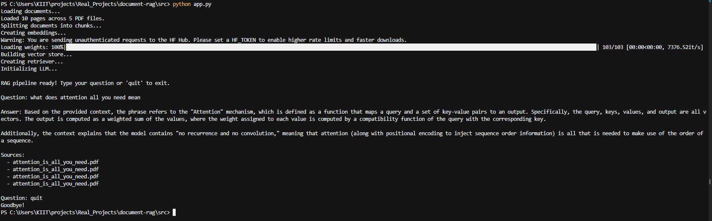

# Document RAG

A Retrieval-Augmented Generation (RAG) pipeline that answers questions over a collection of PDF documents using LangChain, ChromaDB, and OpenRouter LLMs.

## Overview

This project ingests PDF files, splits them into searchable chunks, stores embeddings in a vector database, and uses an LLM to generate grounded answers from the retrieved context.

## Demo



**Pipeline:**

```
PDFs → Load → Chunk → Embed → ChromaDB → Retrieve → LLM → Answer
```

## Features

- **PDF ingestion** — loads and parses PDFs page-by-page with metadata tracking
- **Semantic chunking** — splits documents into overlapping 1000-char chunks for better retrieval
- **Local embeddings** — runs HuggingFace `all-MiniLM-L6-v2` locally, no API key needed for embeddings
- **Persistent vector store** — ChromaDB stores embeddings on disk so re-indexing is only needed once
- **Source attribution** — every answer includes the source filenames it was derived from
- **Interactive CLI** — ask questions from the terminal with a simple REPL
- **Jupyter notebook** — step-by-step walkthrough of the full pipeline

## Project Structure

```
.
├── data/
│   └── sample/                 # Sample PDF documents
│       ├── adam_optimizer.pdf
│       ├── attention_is_all_you_need.pdf
│       ├── bert.pdf
│       ├── gpt3_few_shot_learners.pdf
│       └── resnet.pdf
├── notebooks/
│   └── RAG_Implementation.ipynb  # Interactive notebook walkthrough
├── src/
│   ├── app.py                  # CLI entry point
│   ├── chunking.py             # Document splitting
│   ├── embeddings.py           # HuggingFace embedding model
│   ├── generation.py           # LLM via OpenRouter
│   ├── ingestion.py            # PDF document loading
│   ├── rag_chain.py            # RAG prompt + retrieval chain
│   ├── retrieval.py            # Chroma retriever setup
│   └── vector_store.py         # ChromaDB vector store
├── .env                        # API keys (not committed)
├── requirements.txt
└── LICENSE                     # MIT
```

## Setup

### 1. Clone and install

```bash
git clone https://github.com/<your-username>/document-rag.git
cd document-rag
pip install -r requirements.txt
```

### 2. Configure API key

Create a `.env` file in the project root:

```
OPENROUTER_API_KEY=sk-or-v1-your-key-here
```

Get a free key at [openrouter.ai](https://openrouter.ai/keys).

### 3. Add your documents

Place PDF files in `data/sample/` (or update the path in `app.py`).

## Usage

### CLI

```bash
cd src
python app.py
```

Then type questions interactively:

```
Question: What is the transformer architecture?

Answer: The transformer is a model architecture introduced in "Attention Is All You Need"...

Sources:
  - attention_is_all_you_need.pdf
  - bert.pdf
```

Type `quit`, `exit`, or `q` to stop.

### Notebook

Open `notebooks/RAG_Implementation.ipynb` in Jupyter and run through each cell to see the pipeline step by step.

## How It Works

| Module | What it does |
|---|---|
| `ingestion.py` | Loads PDFs from a directory using `PyPDFLoader`, attaches source filenames as metadata |
| `chunking.py` | Splits pages into 1000-char chunks with 200-char overlap using `RecursiveCharacterTextSplitter` |
| `embeddings.py` | Creates `all-MiniLM-L6-v2` embeddings via HuggingFace (runs locally) |
| `vector_store.py` | Stores chunks + embeddings in a persistent ChromaDB collection |
| `retrieval.py` | Exposes a retriever that returns the top-4 most relevant chunks for a query |
| `generation.py` | Initializes a free OpenRouter chat model for answer generation |
| `rag_chain.py` | Ties it all together: retrieves context → formats prompt → calls LLM → returns answer + sources |

## Configuration

Key parameters you can adjust:

| Parameter | Location | Default | Description |
|---|---|---|---|
| `chunk_size` | `chunking.py` | `1000` | Max characters per chunk |
| `chunk_overlap` | `chunking.py` | `200` | Overlap between consecutive chunks |
| `model_name` | `embeddings.py` | `all-MiniLM-L6-v2` | HuggingFace embedding model |
| `k` | `retrieval.py` | `4` | Number of chunks retrieved per query |
| `model` | `generation.py` | `inclusionai/ling-3.0-flash-vl:free` | OpenRouter LLM model |
| `temperature` | `generation.py` | `0` | LLM temperature (0 = deterministic) |

## License

MIT — see [LICENSE](LICENSE).
